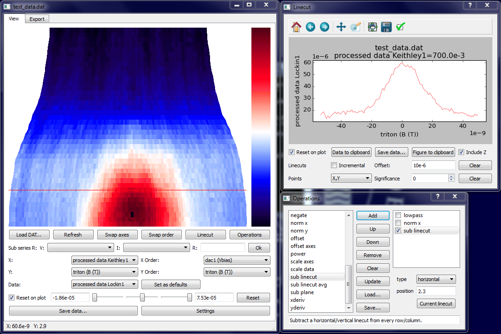

## Installing

Qtplot is compatible with both Python 2 and 3. Using the Anaconda Python distribution (https://www.continuum.io/downloads) is recommended to make installing packages like `numpy` and `scipy` easier.

Create a new environment:

`conda create --name qtplot python=3.5`

Install qtplot:

`pip install qtplot`

Install other dependencies with:

`conda install numpy scipy pandas matplotlib pyqt=4`

Executables will be generated in the `/Scripts` folder of your Python environment with the names `qtplot.<exe>` and `qtplot-console.<exe>`. Associate one of these with `*.dat` files for them to be automatically opened in qtplot.
